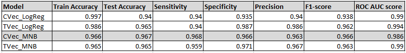
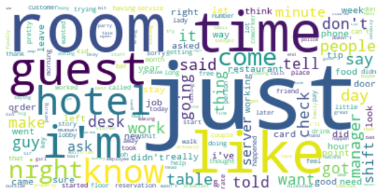
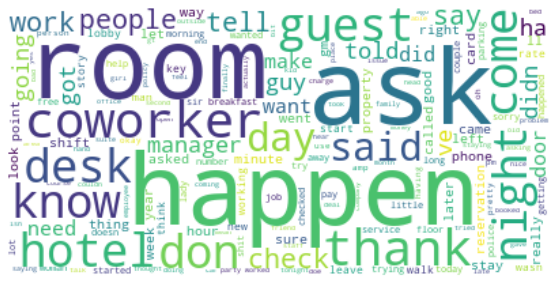

#  

# Project 3: Web APIs & Classification

##### Author: Joey Chew, DSI-13, 12 Mar 2020

---

### Executive Summary

Task was given to collect posts from 2 subreddits via json extraction. Subsequently, NLP was to be used to train a classifier on which subreddit a given post came from; a binary classification problem.

Data was to be gathered and prepared by using the `requests` library.
Two models were to be created and compared. Of which, one of these was to be a Bayes classifier.

Other deliverables included:
A Jupyter Notebook with analysis for a peer audience of data scientists.
An executive summary of the results found.
A short presentation outlining process and findings for a semi-technical audience.

The two subreddits chosen were TalesFromTheFrontDesk (Target Variable: Class 1) and TalesFromYourServer (Target Variable: Class 2).

Multinomial Naive Bayes and Logistic Regression Models were chosen, in combination with Count Vectorization and TFIDF (term frequency–inverse document frequency) Vectorization for comparison.

Based on our results, the Count Vectorization Multinomial Naive Bayes Model was the most suitable model. It achieved a 96.7% test accuracy, with a low false negative rate, leading to a Sensitivity of 96.8%. It was also a robust model which would generalise well on unseen data, with its test accuracy beating its train accuracy of 96.6%

Beyond the academic exercise, as the data is based on real-world information, given the high performance, it could be further developed to assist hotel associations as per the problem statement detailed below.

---

### Problem Statement

We are from the American Hotel and Lodging Association.

In recent years, frontdesk staff at hotels have been leaving due to increased workload and possible burnout.

As frontdesk staff decrease, workload increases for remaining staff, who then leave in turn. Furthermore, this has a strong negatively impact on customer experience at front desks. 

There is a strong need to stem this outflow of frontdesk staff by understanding their concerns and improving their working conditions.

By being able to classify all hotel staff feedback quickly and accurately via our model, the correct management action by hoteliers can be taken in a timely fashion to reduce frontdesk staff turnover.

A successful model would have high accuracy, and be able to generalise well unto unseen data. Such a robust model will be usable for ongoing new hotel staff feedback. Accuracy of 90% and above is to be expected.

---

### Data Collection

1096 rows of data were extracted from TalesFromYourServer.

870 rows of data were extracted from TalesFromTheFrontDesk.

Pipelines were used to combine Vectorization and Classifier Models. In turn, GridSearchCV was applied to determine optimal hyperparameters.

For the data scraping process from Reddit, a 'for' loop with 'sleep_duration' was used to pull posts automatically, with randomised pauses inbetween pages of posts pulled.

---

### Data Cleaning & EDA

It was discovered that only 2 posts had NaN for their text (empty posts). After investigating the 2 posts, it was clear that there was no erraneous keying in text in the title, and that the 2 posts were indeed empty. Due to this, and the limited impact of removing them, the decision was made to fully remove these 2 posts.

Checks were made for duplicate posts within each subreddit, as well as across both subreddits. This was to prevent any duplicate posts being counted in for both categories, or having one of them dropped without due consideration by built-in functions. It was discovered that there were no duplicate posts.

Outliers in this case could be posts whose content had nothing to do with the subreddits they were posted in. However, due to the nature of subreddits having their own moderators, there was likely no significant impact of outliers here, unless they were recent posts not moderated yet. If more data was on hand, dropping posts less than 2 weeks old would likely ensure all remaning posts were moderated, and effectively remove all outliers from data.

Summary Statistics extracted would include Specificity, Sensitivity/Recall, Precision, F1-score, ROC-AUC score. These are discussed in the Evaluation section below.

Other Summary Statistics and EDA were:
Sufficient maximum possible features to train the model on, eg. No. of Word Features exceeding 14491 alone just Train data.
Frequency Counts of each Word Feature, to ensure that there was appropriate distribution, eg. not all words having same frequency, or only a few words having all frequency and others having extremely low frequency.

The provided data seemed sufficient to address the problem statement, given that it was relatively clean, had almost no duplicates, and had a combined total of 1866 initial values of target variable, subreddit title, with corresponding predictor variables to work with.

---

### Preprocessing and Modeling

Text data was successfully converted to matrix representation for use with classifiers. Count Vectorizer and TFIDF Vectorizer were used to accomplish this.

Stop words and Lemmatization were used for pre-processing, but Stemming was not chosen, as it had the tendency to reduce some unrelated words into their prefixes based just on spelling of the words. If time and resources permitted, with more appropriate Stemming dictionaries, it could be used.

Data was split into Train and Test. Test data was used as the Holdout data to compare the success rate of the eventual models. Train data was treated with GridSearchCV for with KFold = 10, to reduce the risk of overfitting.

Of the Bayes models, as the word features were not valued at 1 or 0, but instead, at the their frequencies, leading to the reality of non 0 and 1 integers, BernoulliNB was not an option. GaussianNB was not ideal either, as the word features had discrete and not continous values, and there was no guarantee of them following a normal distribution. MultinomialNB was chosen as it handles non 0 and 1, discrete integer values well.

The other model chosen was Logistic Regression. It is very suitable for binary classification, which suits our task and problem statement well. Furthermore, it generalises relatively well, by having built-in Lasso and Ridge penalty hyper parameters for regularization, and feature reduction, colinearity addressing.

MultinomialNB calulates the probability of each set of predictor variables resulting in target variable value of Class 0 or Class 1. The class with the higher probabilty is then predicted as the likely outcome.

Logistic Regression assumes a linear relationship (optimised on minimising residuals), to which a logit function is applied, to calculate and then the probabilities of each set of predictor variables to between 0 and 1. Any probabilties less than 0.5 are considered Class 0, and 0.5 and above, predicted as Class 1.

---

## Evaluation and Conceptual Understanding

Baseline Score is accuracy of 0.52, based on naive assumption of all posts belonging to majority class, in this case that is Class 0, TalesFromYourServer.

A more in-depth look at metrics used to address problem objective and interprete results of the model:

Sensitivity/Recall (True Positives/All Positives)
Interpretation: Among those which were actually Class 1, FrontDesk, what was the fraction that was correct?

Specificity (True Negative/All Negative)
Interpretation: Among those which were actually Class 0, YourServer, what was the fraction that was correct?

Precision (True Positive/Predicted Positive)
Interpretation: Among those the model predicted to be Class 1, FrontDesk, what was the fraction that was correct?

F1 score (2*(Recall * Precision) / (Recall + Precision))
Interpretation: F1 Score is the weighted average of Precision and Recall. Therefore, this score takes both false positives and false negatives into account.

ROC AUC score
One ROC curve was generated per model by varying the threshold from 0 to 1. This did not actually change the threshold for our original predictions, but it helps in visualizing the tradeoff between sensitivity and specificity and understanding how well-separated the populations are.

A ROC AUC score of 1, means that positive and negative populations are perfectly separated and the model is as good as it can get. Thus, the closer your ROC AUC is to 1, the better, with 1 being the maximum score.

Based on the results tallied above, the production model chosen is the TVec_MNB model. All 4 models have very high scores across all categories (>90). However, as false negatives are more important than false positives here, a high Sensitivity indicating low false negatives is most desirable.

Thus the CVec_MNB model with the highest Sensitvity of 0.968 while still having an accuracy of 0.967 on test data is deemed the model that best solves our problem statement. It is also robust and will generalise well on unseen data, as its test accuracy is higher than its train accuracy of 0.966.

Both CVec and TVec LogReg models have test accuracy 2-3% lower than their train accuracy which is very high, compared with the other models. This indicates overfit, and thus makes them a less favourable choice.

The TVec_MNB model is weaker than the CVec_MNB model is all categories execpt for Precision and ROC AUC score, which is scores slightly better. This indicates that the TVec_MNB model could be better at sorting out unbalanced classes, but as our data is relatively balanced here, CVec_MNB is the preferred choice.

---

## Conclusion and Recommendations

CVec_LogReg model (Accuracy 0.965) is vastly better than the Baseline Model (Accuracy 0.522) and it has also succeeded in fulfiling the problem statement's >.90 accuracy requirement stated earlier.

This model will be able to process hotel staff feedback automatically, and separate out the desired frontdesk staff feedback with a very high accuracy, with low false negatives.

Given the high performance of the model, we look forward to seeing the results of quick management action which will reduce frontdesk staff turnover, increasing morale and service standards, leading to increased customer satisfaction from better service.

A study could be done 6 months later to check the gain of the model.

Alternatively, more data could be gathered to improve the model on an ongoing basis, with results being compared on a monthly basis.

---

## Additional

Here are some visuals showing the impact of the data cleaning on the words, and the relative significance of certain words via wordclouds.

##### Pre-Modeling Word Cloud:

##### Production-Model Word Cloud:

2 more models were also done based on applying Random Forests Model to CVec and Tvec. However, as the hyperparameters required much more time to tune, and the initial 4 models done were sufficient to achieve good results, full investigation of the Random Forests was not completed due to limited resoures and time.

With more time, data or resources, other models which may fit even better could be developed, but given efficiency reasons, the CVec-MNB model seems to be the best fit for this scenario.

